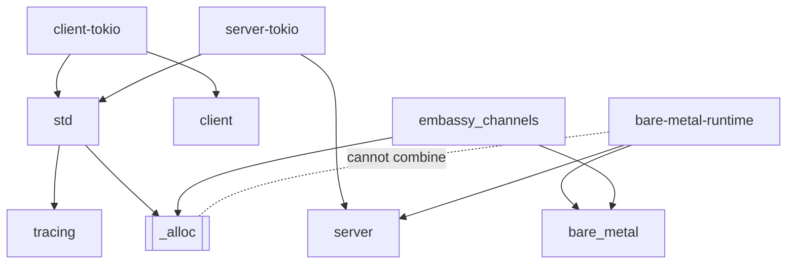

# Contributing

Pull requests are welcome, as are bug reports and questions in the issue
tracker.

The crate implements the
[Open SOME/IP Specification](https://github.com/some-ip-com/open-someip-spec).
`README.md` describes the module layout; this document covers the parts of the
build that are easy to get wrong.

## The feature graph

`#![no_std]` is unconditional: `std` is the feature that adds `std` back, not a
switch that turns `no_std` on. `default = ["std"]`.

A solid arrow means *enables*; the dashed link marks a pair that refuses to
compile. `_alloc` is double-bordered because it is private — every other node
is a feature you are meant to turn on.



What the graph doesn't show:

- **`client` / `server` are the executor-agnostic trait surface** — no tokio, no
  socket2. You supply `Spawner`, `Timer`, `ChannelFactory` and
  `TransportFactory`. The `-tokio` variants add the defaults that make
  `Client::new` and `Server::new` work, and force `std`.
- **`bare_metal` alone is not bare-metal-complete.** It activates embassy-sync as
  the channel backend along with `static_channels`, `AtomicInterfaceHandle` and
  `StaticE2EHandle` — but `client` and `server` still need your own `Spawner` and
  `TransportFactory` impls.
- **`bare-metal-runtime` is server-side only.** It pulls in `server`, not
  `client` — it composes the embassy executor and the single task around the
  server. A bare-metal *client* is `client` + `bare_metal` with an executor you
  supply; see `examples/bare_metal_client/`.
- **`bare-metal-runtime` cannot be combined with the alloc features.** A
  `compile_error!` rejects it alongside `_alloc`, and therefore alongside `std`,
  `embassy_channels` and both `*-tokio` features. It also needs nightly, for
  `impl_trait_in_assoc_type`. Build it alone:
  `cargo +nightly check --no-default-features --features bare-metal-runtime,server`.
- **`_alloc` is private; do not enable it directly.** It marks "this build needs
  `extern crate alloc`" and is tied to the declaration in `lib.rs` so both sides
  move in lockstep.
- **`tracing` is gated rather than always-on** because `tracing-core` declares
  `extern crate alloc` unconditionally, which bare-metal targets shipping a
  `core`-only sysroot cannot satisfy.
- **`embassy_channels` is the heap-backed channel backend** — useful for tests or
  early prototypes, before static pools are sized.

## Testing

Most integration tests declare `required-features`, so a bare `cargo test`
silently skips them. Run the configurations, not just the default:

```sh
cargo test --features client-tokio,server-tokio       # the async engines
cargo test --features client,bare_metal               # the bare-metal client
cargo test --features server,bare_metal               # the bare-metal server
cargo test --no-default-features                      # the no_std core alone
```

There is deliberately no `--all-features` line: it enables
`bare-metal-runtime` alongside `std` and hits the `compile_error!` above.

Two tests are allocation witnesses (`no_alloc_witness`,
`no_alloc_server_witness`) and run with `harness = false`: they fail if the
no-alloc paths start allocating. Treat a change that trips one as a design
question, not a test to adjust.

The bare-metal examples are workspace members and exercise the real
configuration rather than a feature flag on the root crate:

```sh
cargo build -p bare_metal_client
cargo build -p bare_metal_server
```

`tests/wire_golden.rs` pins the bytes on the wire. A round-trip test written
against the crate's own output passes whenever encode and decode share the same
misreading, so a wire-format change should either fail a golden vector or add
one.

## Minimum supported Rust version

The manifest deliberately declares no `rust-version`, and CI's MSRV job is
switched off as a result. Picking a floor is a policy decision about what the
project commits to supporting — if you need one, raise it as an issue rather
than adding it as a side effect of another change.

## Commits and pull requests

Commit subjects follow [Conventional Commits](https://www.conventionalcommits.org/)
(`feat:`, `fix:`, `docs:`, `build:`, `chore:`, with a `!` for a breaking
change), because the changelog is organized around them.

`Linear PR History` is a required check: rebase onto `main` rather than merging
`main` into your branch.

## Continuous integration

Two pipelines currently run side by side: this repository's own workflow, which
produces `Format & Lint`, `Build, Test & Coverage`, the Windows and
bare-metal/no_std builds and `SemVer Check`; and the org-wide reusable workflow
from [`luminartech/rust_workflow`](https://github.com/luminartech/rust_workflow),
which produces the `ci / *` checks. The three required checks come from the
former.

## Releases

[release-plz](https://release-plz.dev) owns versioning, the changelog, tags,
GitHub releases, and the crates.io publish. There is no version to bump by
hand: a push to `main` maintains an open release PR, and merging that PR
publishes.
